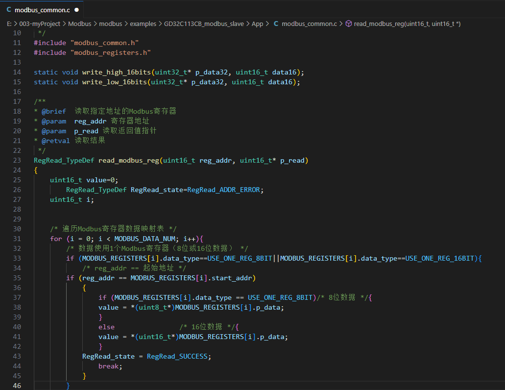

# VSCode_clang-format_guide
在VSCode中安装和使用clang-format格式化C/C++代码



### 1. 安装C/C++插件

在VSCode扩展中搜索 `C/C++` ，安装C/C++插件。最新的C/C++插件里集成了 clang-format，所以不用再下载clang-format插件。

### 2. 配置C/C++插件

在VSCode `设置` 中，依次点击：`拓展` -> `C/C++` -> `格式设置`。

#### 2.1 C_Cpp: Clang_format_path

`clang-format.exe` 的绝对路径。在 `C_Cpp:Clang_format_path` 中填入 `clang-format.exe` 的绝对路径。 `clang-format.exe` 一般在安装C/C++插件时就已经附带了，路径为：`C:\Users\$用户名\.vscode\extensions\ms-vscode.cpptools-1.25.3-win32-x64\LLVM\bin\clang-format.exe`。

如果上面路径不存在，也可以使用本文提供的 `clang-format.exe` 。

#### 2.2 C_Cpp: Clang_format_style

`.clang-format` 文件的绝对路径。在 `C_Cpp: Clang_format_style` 中填入 `.clang-format` 的绝对路径 ，对所有工程都有效，比如：`file:C:\Users\$用户名\.vscode\extensions\ms-vscode.cpptools-1.25.3-win32-x64\LLVM\bin\.clang-format`。

如果希望只对当前的工程生效，可以将 `.clang-format` 添加到当前的工作目录中，但对于使用VSCode插件的Keil项目，配置文件放在工作目录中**无法生效**。

#### 2.3 C_Cpp: Formatting

选择 `clang-format`，设置 clang-format 为C/C++代码的格式化引擎。

#### 2.4 C_Cpp: Clang_format_fallback Style（可选）

当设置了clang-format且没有.clang-format文件时，会使用这里选择的默认设置来设置格式，比如：`LLVM`。

### 3. 如何使用

配置完成后，打开一个 `.c/.cpp` 文件，在文件中 `右击` -> `格式化文档`，或按 `Alt + Shift + F` 即可对当前文件执行格式化操作。

#### 3.1 临时禁用

有一些代码，我们并不想让clang-format调整格式，这时可以使用注释临时禁用clang-format

```c
// clang-format off

这两个注释中间的代码不受clang-format的影响

// clang-format on
```

### 4. .clang-format 示例

[.clang-format](./.clang-format)，本人个人项目中所使用的编码风格，主要源于[《华为技术有限公司C语言编程规范》](./华为技术有限公司c语言编程规范.pdf)。

